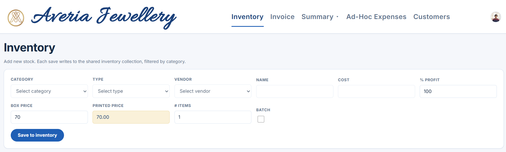
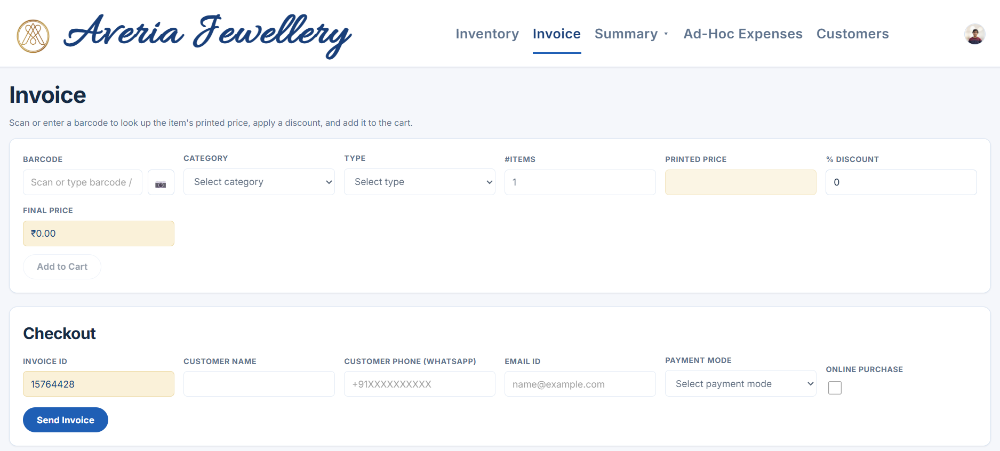
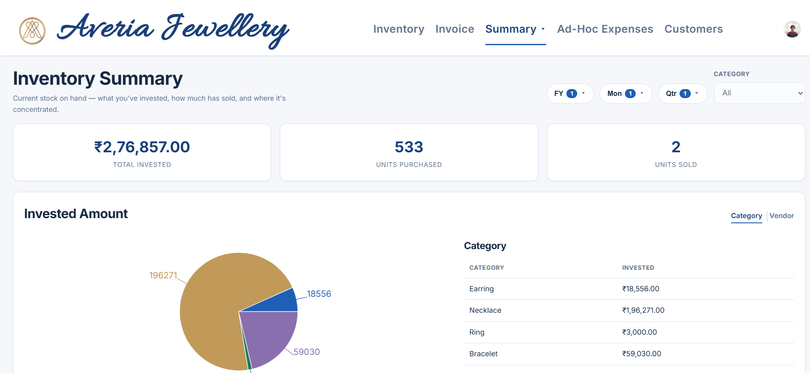
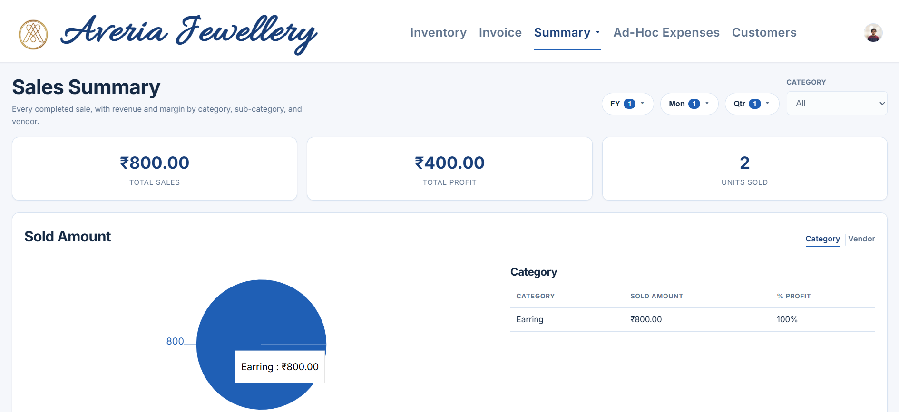
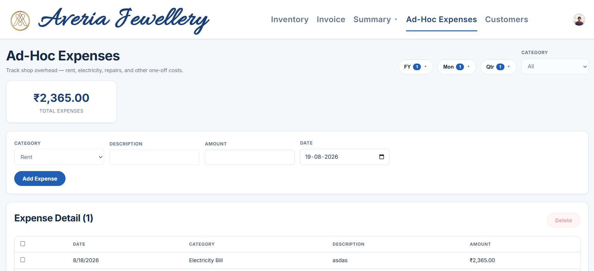
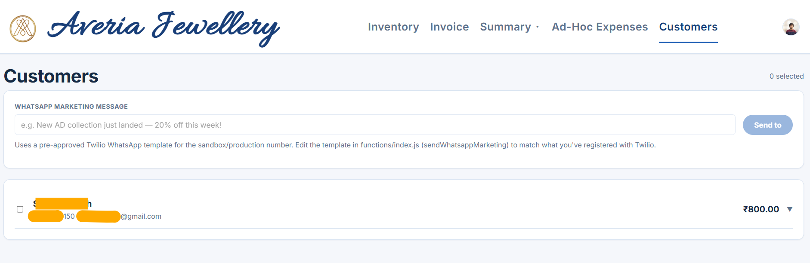

# Jewellery Shop Manager

A lightweight single-page React application for managing a small jewellery shop: inventory intake, barcode-driven invoicing, customer management, sales summary, and WhatsApp-based communication. The app uses Firebase for authentication, storage, Firestore database and Cloud Functions to generate PDFs and send WhatsApp messages via Twilio.

---

## Table of contents

- [Features](#features)
- [Screenshots](#screenshots)
- [Tech stack](#tech-stack)
- [Prerequisites](#prerequisites)
- [Quick start](#quick-start)
- [Firebase setup](#firebase-setup)
- [Twilio / WhatsApp setup](#twilio--whatsapp-setup)
- [Configuration](#configuration)
- [Development & build](#development--build)
- [Deploy](#deploy)
- [Customizing invoice PDF](#customizing-invoice-pdf)
- [Contributing](#contributing)
- [License](#license)

---

## Features

- Role-based access (admin / worker).
- Inventory CRUD with configurable categories, types and vendors.
- Barcode/QR scanning for fast invoice line-item lookup (html5-qrcode).
- Create invoices, apply discounts and generate/send PDFs via Cloud Functions.
- Customers list with WhatsApp messaging integration (Twilio).
- Responsive layout and simple admin UI for shop configuration.

## Screenshots

| Inventory intake | Invoice / checkout |
| --- | --- |
|  |  |

| Inventory Summary | Sales Summary |
| --- | --- |
|  |  |

| Ad-Hoc Expenses | Customers |
| --- | --- |
|  |  |

## Tech stack

- React + JSX
- Vite (build tooling)
- Firebase: Authentication, Firestore, Storage, Cloud Functions
- Twilio (WhatsApp) used from Cloud Functions
- html5-qrcode (client barcode scanner)

## Prerequisites

- Node.js 18+ and npm
- A Firebase project with Billing enabled (Blaze) for external API calls
- Twilio account for WhatsApp (sandbox for testing)

## Quick start

1. Copy the example env and fill in Firebase config:

   cp .env.example .env
   # edit .env and add Firebase SDK config and allowed admin/worker emails

2. Install dependencies:

   npm install
   cd functions && npm install && cd ..

3. Run dev server:

   npm run dev

4. To run Cloud Functions locally (optional):

   firebase emulators:start --only functions,firestore,storage

## Firebase setup

1. Create a Firebase project and enable Firestore, Storage and Hosting.
2. Enable Billing (Blaze) if you plan to use Twilio or other external APIs.
3. From Project Settings → General → Add web app, copy the Firebase config into `.env` (use `.env.example` as a template).
4. Authenticate the Firebase CLI and select the project:

   npm install -g firebase-tools
   firebase login
   firebase use --add

5. (Optional) Set Cloud Functions secrets for Twilio:

   firebase functions:secrets:set TWILIO_ACCOUNT_SID
   firebase functions:secrets:set TWILIO_AUTH_TOKEN
   firebase functions:secrets:set TWILIO_WHATSAPP_FROM

## Twilio / WhatsApp setup

- For local testing you can use Twilio's WhatsApp sandbox (Console → Messaging → Try it out). For production you must provision a WhatsApp-enabled number and register templates for marketing messages.
- The app's Cloud Function expects Twilio credentials as secrets (see above).
- Note: WhatsApp free-form messages are permitted only within 24 hours of a user's last message; marketing blasts require approved templates.

## Configuration

Primary configuration lives in `src/config/shopConfig.js`:

- shopName, logoPath, currencySymbol
- categories, types (per-category type lists), vendors
- paymentModes, defaults (profit percent, box price, default item count)
- inventoryFields / invoiceFields — drive which form fields are shown and their behavior

To change allowed admin/worker users, set the environment variables in `.env`:

- VITE_ALLOWED_ADMINS (comma separated emails)
- VITE_ALLOWED_WORKERS (comma separated emails)
- VITE_SUPER_USER (single email) — the only account that can bulk-delete rows on Inventory Summary and Ad-Hoc Expenses; must also appear in VITE_ALLOWED_ADMINS to sign in at all

## Development & build

- Start dev server:

  npm run dev

- Build for production:

  npm run build

## Deploy

1. Build assets: `npm run build`
2. Deploy hosting, functions and security rules:

   firebase deploy --only hosting,functions,firestore:rules,storage:rules

## Customizing invoice PDF

Edit `functions/templates/invoiceTemplate.js`. The template receives a `pdfkit` `doc` instance and invoice data. Make layout and styling changes there and redeploy functions.

## Contributing

- Please open issues for bugs or feature requests.
- Create topic branches for changes and open pull requests to `main`.
- Keep commits focused and add a short description for reviews.

## License

MIT — see [LICENSE](LICENSE).

